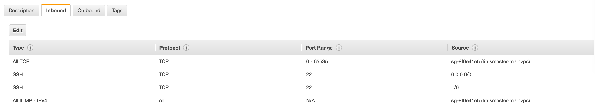
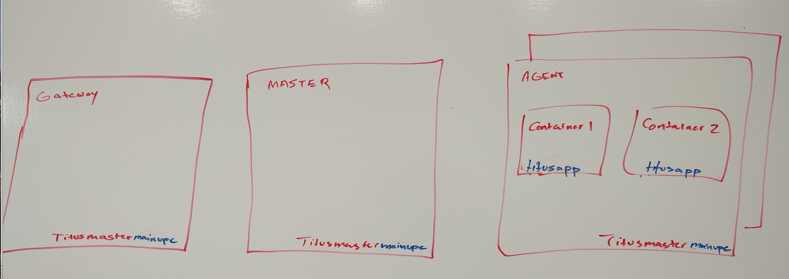
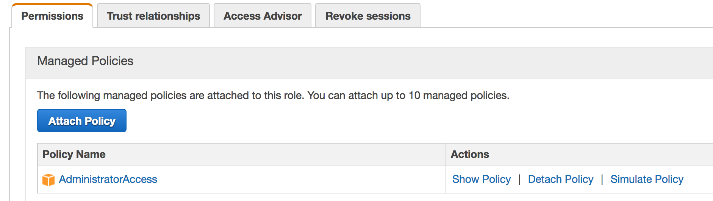

# Subnets
The Titus agent must run in a "private subnet" (Amazon terminology), or a Subnet which does not rely on 1:1 NAT for communication across the VPC boundary. This is because the Titus VPC integration code sets up agent IPs in the same subnet that the agent is spawned in, and the containers use secondary Private IPs. The driver does not set up any kind of NAT on these secondary IPs, so they are without ingress connectivity.

## VPC Setup
In the most minimal Titus install, you need to create a VPC with a "public" and "private" subnet. All of your Titus infrastructure will live in the private subnet.

You will not be able to SSH directly into your Titus instances. You need to create a instance with the `titusmaster-mainvpc` and `titusbastions` security groups. This instance should be provisioned in the _Public_ subnet(s). You can then go ahead and SSH to this instance with the `-A` option. 

The default Amazon VPC wizard will create this for you. If you need to scale your Titus cluster, you need to copy the configuration of the _private_ subnets, and create one per availability zone.

A slightly more advanced version of this configuration is to configure IPv6 on the private subnet, and use an igw for the IPv6 routing for that subnet, so you can SSH directly to the Titus infrastructure on their IPv6 addresses.

# Creating security groups

Three security groups are needed. We are naming them `titusbastion`, `titusapp`, `titusmaster-mainvpc`:


## Bastion Security Group
For inbound:

- From anywhere, TCP 22
- From anywhere, All ICMP

## Infrastructure security group

This is for the `titusmaster-mainvpc` security group

For inbound

- From titusmaster-mainvpc security group, ALL TCP, All ICMP
- From anywhere (including Internet), SSH



For outbound

- All traffic


## App security group

This is for the `titusapp` 

For inbound and outbound

- Up to your application needs

# Overview of the applied security groups

Eventually this is how the security groups you created will be used



# Creating IAM Roles

Three IAM roles are needed. We are naming them `titusmasterInstanceProfile' and 'titusappwiths3InstanceProfile'
and 'titusappnos3InstanceProfile'.


## Infrastructure IAM Role

For now, we are using a wide open IAM role. We can refine this later.



## App IAM Roles

You need to allow this IAM Role to be assumed into via the Infrastructure Role. You can do this by setting
up trusted relationships. It should look like this:


The Trust relationship should look like:

```
{
  "Version": "2012-10-17",
  "Statement": [
    {
      "Effect": "Allow",
      "Principal": {
        "Service": "ec2.amazonaws.com"
      },
      "Action": "sts:AssumeRole"
    },
    {
      "Effect": "Allow",
      "Principal": {
        "AWS": "arn:aws:iam::ACCOUNTID:role/titusmasterInstanceProfile"
      },
      "Action": "sts:AssumeRole"
    }
  ]
}
```

For permissions, pick two sets of permissions that matter to your apps. We created one with S3 read access
and one without to be able to test the IAM role support feature.

# Overview of the applied IAM Roles

Eventually this is how the IAM roles you created will be used


