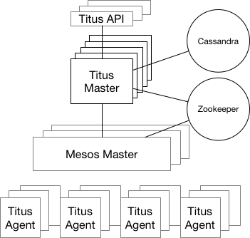

Titus is a container management platform that provides scalable and reliable container execution and
cloud-native integration with Amazon AWS.

## Background

Titus was built internally at Netflix and is used in production
to power Netflix streaming, recommendation, and content systems. Titus development began in 2015 when the
container management space was still nascent and with a focus on Netflix scale, reliability, and tight
integration with Amazon AWS and other Netflix systems, both OSS and internal.

Titus aims to enable easy and reliable deployment of containerized batch and service applications.
Achieving this goal requires:

- Allowing containerized applications to seamlessly interact with AWS, Netflix, and other cloud services.
It should be easy for containerized applications to access, and be accessed by, other services.
- Operability to ensure the system is capable of running mission critical workloads.
- Scalability to run tens of thousands of containers on top of thousands of hosts.

## Architecture

Titus was built as a framework on top of Apache Mesos, a cluster-management system that brokers
available resources across a fleet of machines. Titus consists of a replicated, leader-elected scheduler
called Titus Master, which handles the placement of containers onto a large pool of EC2 virtual machines
called Titus Agents, which manage each container's life cycle. Zookeeper manages leader election, and
Cassandra persists the master's data.  The Titus acrchitecure is shown below.

Work in Titus is described by a job specification that details what to run
(e.g., a container image and entry point), metadata (e.g., the job's purpose and who owns it), and
what resources are required to run it, such as CPU, memory, or scheduling constraints (e.g., availability
zone balancing or host affinity). Job specifications are submitted to the master and consist of a
number of tasks that represent an individual instance of a running application. The master schedules
tasks onto Titus agents that launch containers based on the task's job specification.